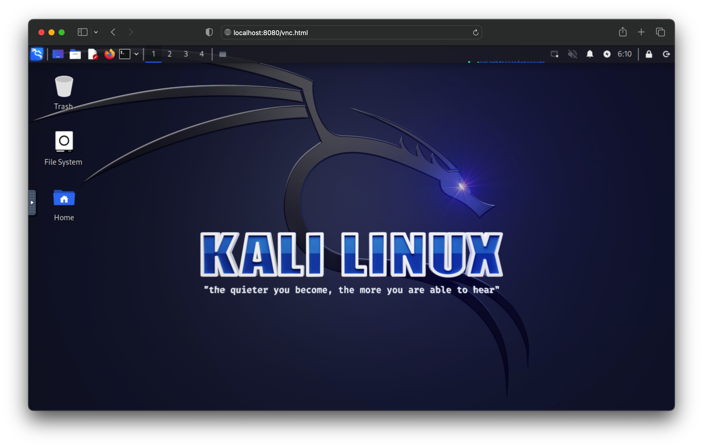

# Kali Linux desktop no navegador

Este repositório contém os arquivos Docker Compose para roda um container com o Kali Linux acessível através do VNC através do navegador.



# Descrição

Esta aplicação Docker Compose inclui um container chamado Kalilinux e um servidor NoVNC com um ambiente Kali Linux Desktop.

O password e usuário padrão podem ser alterados no arquivo docker-compose.yml

# Requisitos

Para rodar esta aplicação Docker Compose, você precisa ter instalado no seu computador:

- Docker Engine
- Docker Compose

# Uso
Para usar o Kali Linux em seu navegador siga os passos abaixo:

1. Clone the repository:
    ```
    git clone https://github.com/xxxxxxxxxxxxxxxxxxxxxx
    ```
2. Navegue até o diretório:
    ```
    cd kali-docker
    ```
3. Construa a imagem ( este processo pode demorar um pouco dependendo da sua internet por conta do download dos pacotes e dependências ):
    ```
    docker-compose build
    ```
4. Inicie os containers:
    ```
    docker-compose up -d
    ```

O processo acima irá criar e iniciar os containers e você poderá acessar o Kali Linux no navegador no endereço: http://localhost:8092/vnc.html

Para encerrar a aplicação pode pressionar CTRL+C na janela do terminal onde a aplicação foi iniciada ou rodar o comando abaixo:
```
docker-compose down
```
